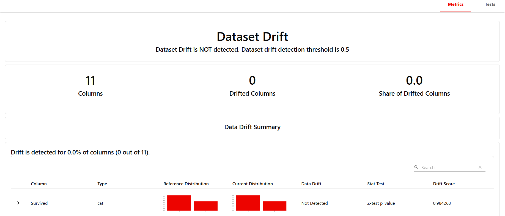
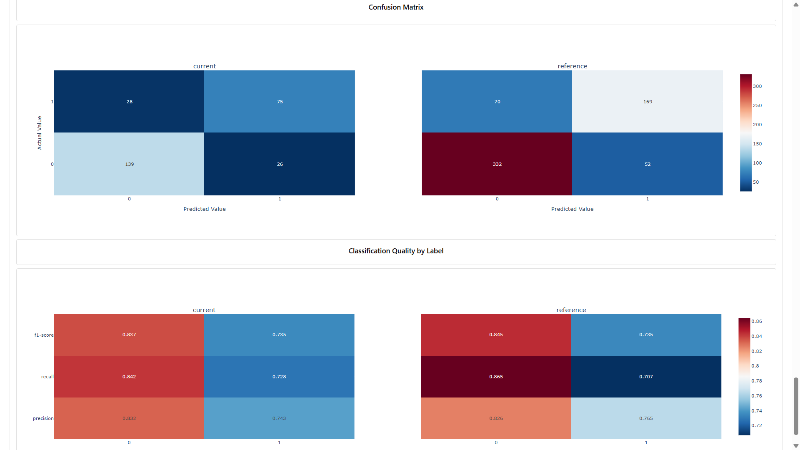
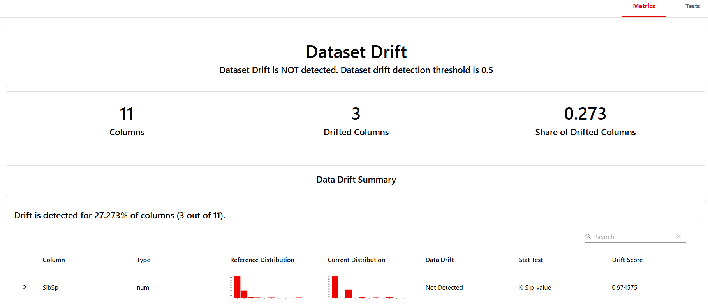
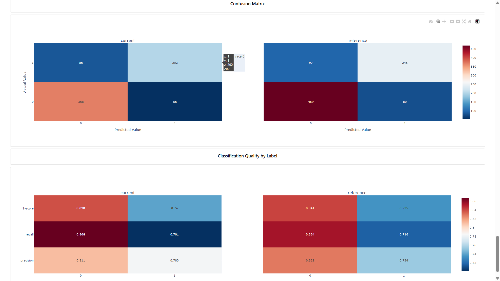

# Data Anchor: Comprehensive Data Validation & Monitoring Platform

[](https://www.python.org/)
[](LICENSE)
[](https://greatexpectations.io/)
[](https://www.evidentlyai.com/)

##🛡️ Data Anchor: Ensuring Trustworthy Data & Models with Drift Detection + Validation

## ❓ Why Data Anchor?
Machine learning systems fail silently when data changes.  
Data Anchor prevents this by combining **Great Expectations** for validation  
and **Evidently AI** for monitoring, giving you peace of mind that your data  
pipelines stay healthy and your models remain reliable.

## 🚀 Overview

Data Anchor provides a complete solution for data quality assurance and monitoring in machine learning pipelines. The platform integrates multiple validation layers to ensure data integrity, detect distribution shifts, and monitor model performance over time.

### Key Capabilities

- **Automated Data Validation**: Comprehensive quality checks using Great Expectations
- **Drift Detection**: Real-time monitoring of data and model drift with Evidently AI
- **Machine Learning Pipeline**: End-to-end model training and evaluation
- **Rich Visualizations**: Automated generation of insightful data visualizations
- **Modular Architecture**: Extensible design for easy integration and customization
- **Production-Ready**: Logging, error handling, and configuration management

## 📁 Project Architecture

```
Data Anchor/
├── config.yaml                 # Configuration management
├── main.py                     # Main execution orchestrator
├── requirements.txt            # Python dependencies
├── src/                        # Source code modules
│   ├── data_processing/        # Data loading and preprocessing
│   │   ├── data_loader.py      # Data ingestion and quality assessment
│   │   └── data_preprocessor.py # Feature engineering and splitting
│   ├── validation/             # Data validation layer
│   │   └── great_expectations_validator.py # GX validation suite
│   ├── drift_detection/        # Drift monitoring
│   │   └── evidently_drift_detector.py # Evidently AI integration
│   ├── ml/                     # Machine learning components
│   │   └── model_trainer.py    # Model training and evaluation
│   ├── visualization/          # Data visualization
│   │   └── data_visualizer.py  # Chart generation and reporting
│   ├── utils/                  # Utility functions
│   │   └── helpers.py          # Helper functions and utilities
│   ├── logger.py               # Logging configuration
│   └── exception.py            # Custom exception handling
├── data/                       # Data storage
│   ├── raw/                    # Raw datasets
│   ├── processed/              # Processed data
│   ├── reference/              # Reference datasets for drift detection
│   └── current/                # Current datasets for comparison
├── models/                     # Trained model artifacts
├── reports/                    # Generated reports and visualizations
├── notebooks/                  # Jupyter notebooks for analysis
├── tests/                      # Unit test suite
└── docs/                       # Documentation
```

## 🛠️ Installation & Setup

### Prerequisites

- **Python**: 3.9 - 3.12
- **Operating System**: Windows, macOS, or Linux
- **Memory**: Minimum 4GB RAM recommended


## 🚀 Usage

### Complete Workflow Execution

Run the entire data validation and monitoring pipeline:

```bash
python main.py
```

This executes:
1. Data loading and quality assessment
2. Comprehensive data visualizations
3. Great Expectations validation
4. Machine learning model training
5. Drift detection analysis
6. Automated report generation

### Module-Level Usage

## 📊 Core Modules

### Data Processing (`data_processing/`)
- **DataLoader**: Handles data ingestion, quality assessment, and feature analysis
- **DataPreprocessor**: Manages data splitting, feature engineering, and reference dataset creation

### Validation (`validation/`)
- **GreatExpectationsValidator**: Implements comprehensive data validation rules including:
  - Table structure validation
  - Column existence and type checking
  - Data quality constraints
  - Missing value expectations

### Drift Detection (`drift_detection/`)
- **EvidentlyDriftDetector**: Provides drift monitoring capabilities:
  - Data drift detection across numerical and categorical features
  - Target and prediction drift analysis
  - Statistical drift metrics and visualization

### Machine Learning (`ml/`)
- **ModelTrainer**: End-to-end model training pipeline:
  - Logistic regression implementation
  - Cross-validation support
  - Performance metrics calculation
  - Feature importance analysis

### Visualization (`visualization/`)
- **DataVisualizer**: Automated chart generation:
  - Distribution plots and histograms
  - Correlation heatmaps
  - Survival analysis visualizations
  - Feature importance plots

## 📊 Results

## Expectation validation

 Calculating Metrics: 100%  ---------------------  41/41 [00:00<00:00, 491.16it/s]
## Validation successful: True
 Number of expectations: 21
 Successful expectations: 21/21

## Data drift result







The platform generates comprehensive reports and artifacts:

### Reports Directory (`reports/`)
- `ge_validation_result.json` - Great Expectations validation results
- `drift_reportv1.html` - Train vs Test drift analysis
- `drift_reportv2.html` - Reference vs Current drift analysis
- `drift_comparison_report.html` - Comparative drift analysis
- `comprehensive_summary.json` - Complete execution summary
- Various PNG visualizations (distributions, correlations, etc.)


### Data Directory (`data/`)
- `reference.parquet` - Reference dataset for drift detection
- `current.parquet` - Current dataset for comparison

### Models Directory (`models/`)
- Serialized model artifacts for deployment

## 🔧 Configuration Options

### Data Configuration
- Custom dataset paths
- Feature selection and engineering
- Data splitting parameters

### Model Configuration
- Algorithm selection and hyperparameters
- Cross-validation settings
- Performance metrics

### Validation Configuration
- Custom expectation suites
- Validation thresholds and rules

### Visualization Configuration
- Chart styling and themes
- Output formats and resolutions


## 📊 Example Reports
- Data drift dashboard (Evidently)
- Validation summary (Great Expectations)
- Model performance tracking

## ⚠️ Known Issues

- **Model Variable Error**: Current TODO item to fix 'model' variable reference in main.py execution flow
- **Feature Importance Timing**: Visualization block needs repositioning after model training completion

## 🤝 Contributing

We welcome contributions! Please follow these steps:

1. Fork the repository
2. Create a feature branch (`git checkout -b feature/amazing-feature`)
3. Commit your changes (`git commit -m 'Add amazing feature'`)
4. Push to the branch (`git push origin feature/amazing-feature`)
5. Open a Pull Request

### Development Guidelines
- Follow PEP 8 style guidelines
- Add unit tests for new features
- Update documentation for API changes
- Ensure backward compatibility

## 📄 License

This project is licensed under the MIT License - see the [LICENSE](LICENSE) file for details.

## 🙏 Acknowledgments

- **Great Expectations**: For providing the industry-standard data validation framework
- **Evidently AI**: For comprehensive ML monitoring and drift detection capabilities
- **Scikit-learn**: For robust machine learning algorithms and tools
- **Pandas & NumPy**: For fundamental data science infrastructure
- **Matplotlib & Seaborn**: For data visualization excellence

## 📞 Support & Contact

For questions, issues, or contributions:

- **Issues**: [GitHub Issues](https://github.com/your-repo/issues)
- **Documentation**: See `docs/` directory for detailed guides
- **Email**: [aryam7842@example.com]

---

**Data Anchor** - Building reliable foundations for data-driven decision making. 🔍📊🤖
